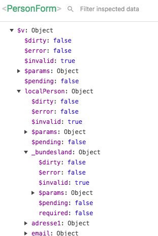

### 1 year vue.js
#### lessons learned
<div>&nbsp;</div>
<div class=""></div>

<div class="left small">
Manfred Wuits<br>
<span class="color1">manfred@werkzeugh.at</span>
</div>

---
### Form-Validation: 

+++?code=showcase/Fotos.vue&lang=html&title=Form-Validation #1: <span class="color1">vee-validate</span> 

<div class="smaller">@fa[minus-circle] validations are inter-mingled with presentational code.</div>

+++
##### Form-Validation #2: vuelidate - validations

```javascript
 validations: function() {
    let validations={
        vorname:{required},
        nachname:{required},
        sex:{required},
        titel:{},
        email:{required, email},
        gebdatum:{
          required,
          isDate (value) {
            return isDate(value);
          },
          isValidAge (value) {
            const age=getAgeFromDatum(value);
            if(age!==null) {
              return age >= this.ageMin && age <= this.ageMax;
            } else {
              return true;
            }
          },
        },
        telefon:{required},
        adresse1:{required},
        plz: { required, plz},
        ort:{required},
        land:{required},
        ognr:{required},
        _bundesland:{required},
    };

    if(this.fixedAddress) {
      validations=R.omit(['_bundesland','ognr','adresse1','plz','ort','land'],validations);
    }

    if(this.showMainMemberNumber) {
      validations.hhnr={required,mitgliedsnr};
    }

    if(this.isMainPerson) {
      validations.werber={mitgliedsnr};
    }

    if(this.personKey.match('child')) {
      validations=R.omit(['telefon'],validations);
    }
    return { localPerson: validations };

  },
```

<div class="smallest">@fa[plus-circle] validation code is within the model</div>

+++ 
##### <span class="color1">vuelidate</span> - validation state


+++ 

##### Form-Validation #2: <span class="color1">vuelidate</span> - markup

```html
<div class="row">
  <form-group class="span-6 alpha" label="Geburtsdatum" 
    :validator="$v.localPerson.gebdatum">
    <input type="text" class="form-control" v-model.trim="localPerson.gebdatum" 
    name="gebdatum" placeholder="TT.MM.JJJJ" @input="$v.localPerson.gebdatum.$touch()">
  </form-group>
</div>
...
<div class="row" v-if='usePlzChooser'>
  <form-group :validator="$v.localPerson.plz" label="PLZ/Ort">
    <v-select :debounce="250" v-model='plzort' :on-search="getPlzorte" 
    :options='plzorte' placeholder="Suche PLZ/Ort" @change="$v.localPerson.plz.$touch()" />
      <div>&nbsp;</div>
  </form-group>
</div>

```

+++ 

##### <span class="color1">vuelidate-error-extractor</span> - markup Helper

```javascript

import vuelidateErrorExtractor from 'vuelidate-error-extractor';

import customFormGroup from './FormGroup.vue';

Vue.use(vuelidate);
Vue.use(vuelidateErrorExtractor, {
  template: customFormGroup,
  messages: {
    required: 'Dieses Feld ist ein Pflichtfeld',
    email: 'Bitte eine gültige e-Mail Adresse eintragen',
    isDate: 'Bitte ein gültiges Datum im Format TT.MM.JJJJ angeben',
    isValidAge: 'Geburtsdatum ist nicht im erforderlichen Altersbereich',
    plz: 'Bitte eine gültige PLZ eingeben',
    mitgliedsnr: 'Bitte eine gültige Mitgliedsnummer eingeben',
     },
});
```


---
### vuex: 


+++?code=showcase/nf_engine/resources/assets/js/components/PersonForm.vue&lang=javascript&title=Using local-state for forms

@[98-100] (create slot in local components-state)
@[426] (load data from vuex-store on component-creation)
@[220] (use getters for that)
@[249] (be sure to use a cloned version, btw: ramda is a friend)


+++?code=showcase/nf_engine/resources/assets/js/store/index.js&lang=javascript&title=<span class="color1">vuex-persistedstate</span> - persist parts of state in local-storage

@[6] (Step 1: import)
@[19](Step 2: select parts of state to preserve, just works)
@[12](optional: define cache-key)
@[20](btw: "strict" is always a good idea)


---
### SVG-icons

use svg-icons as components directly within the vue-bundle

+++
##### <span class="color1">vue-svgicons</span>:

pre-compile SVG-icons:
```json
package.json:
...
    "generate-icons": "vsvg -s ./resources/assets/svg-icons -t ./resources/assets/js/compiled-icons"
...
```
+++ <span class="color1">vue-svgicons</span>: usage

```javascript
import '../compiled-icons/topnav/close';
import '../compiled-icons/sociallinks';
import '../compiled-icons/blog';
```

```html
<div class="pics" v-if="picsMode">
    <a :href="getUrlForPost(p)" v-for="(p,idx) in pics" :key="idx" :class="{isVideo:p.video}">
       <div class="icon-overlay" v-if="p.video">
         <svgicon icon="blog/play"></svgicon>
       </div>
      
    </a>
</div>
```
@[3] 

+++ 
##### <span class="color1">fontawesome5</span> 
---
bundle sizes: 
vue lazy-loading w/o router & webpack bundle size-previews

---
components: 
<span class="color1">vue-strap</span>  vs  <span class="color1">buefy-components</span>
---
content: 
server-side (laravel)  vs  headless-cms (storyblok)

